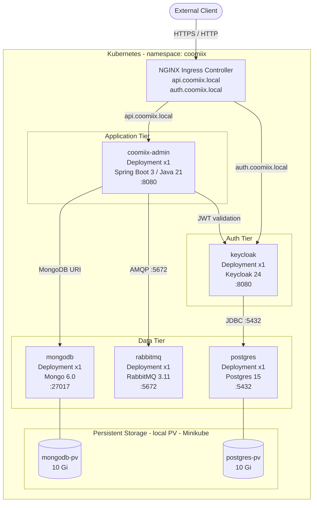

# Coomiix Admin

A Spring Boot service for managing admin resources (players, etc.). It follows a clean layered architecture with domain-driven design concepts, OpenAPI-first contracts, and asynchronous integration via RabbitMQ.

## Overview

| Concern | Technology |
|---|---|
| Language / Runtime | Java 21 |
| Framework | Spring Boot 3.5.3 |
| Data Store | MongoDB 6.0 |
| Messaging | RabbitMQ 3.11 |
| AuthN/Z | Keycloak 24 (OIDC / JWT Resource Server) |
| API Contract | OpenAPI 3 (codegen at build) |
| Reverse Proxy | Traefik (local compose) / NGINX Ingress (k8s) |
| Build | Gradle |
| Testing | JUnit 5, Mockito, Testcontainers |
| Container Runtime | Docker / Minikube (k8s) |

---

## System Architecture

### High-Level Overview

The system is composed of five independently deployed services running inside a dedicated `coomiix` Kubernetes namespace. All external traffic enters through an NGINX Ingress Controller that routes by hostname. Configuration is split between ConfigMaps (non-sensitive) and Secrets (sensitive credentials). Stateful services (MongoDB, PostgreSQL) are backed by local PersistentVolumes pinned to the Minikube node.

### Architecture Diagram


---

## Application Architecture

The codebase is organized by vertical feature (`player`) and horizontal layers, embracing domain-driven design and ports/adapters.

- **Application layer** (`src/main/java/.../player/application`)
  - Use-cases/services coordinate operations and apply application-level rules (e.g., `CreatePlayerService`).
  - Input is expressed as commands/DTOs (e.g., `CreatePlayerCommand`).
- **Domain layer** (`src/main/java/.../player/domain`)
  - Pure domain model (`Player`, value objects like `Email`).
  - Domain events (`PlayerCreatedEvent`) describe meaningful business occurrences.
  - `PlayerRepository` is a port that the domain/application depend on.
- **Infrastructure layer** (`src/main/java/.../player/infrastructure`)
  - Adapters implementing ports, e.g., MongoDB repository (`PlayerMongodbRepository`).
  - HTTP controllers (`PlayerRestController`) mapping OpenAPI to application services.
  - Mappers between domain and persistence/transport (`PlayerDocumentMapper`, `PlayerResponseMapper`).
- **Shared** (`src/main/java/.../shared`)
  - Cross-cutting concerns: domain `EventPublisher`, messaging (RabbitMQ), persistence config (MongoDB), controller exception handling, and base exceptions.

### Events and Messaging

- Domain events are published via an `EventPublisher` implementation that uses RabbitMQ (see `shared/infrastructure/messaging`).
- This enables loose coupling between write operations and downstream consumers.

### Security

- Resource server validates JWTs from Keycloak.
- Issuer and JWK set URIs are configured via `application.properties`.

---

## Project Structure

```
coomiix-admin/
  ├─ k8s/                        # Kubernetes manifests (namespace, deployments, services, ingress, volumes)
  ├─ traefik/                    # Traefik config for local Docker Compose (static config + OIDC middleware)
  ├─ src/
  │  ├─ main/
  │  │  ├─ java/com/coomiix/admin/
  │  │  │  ├─ AdminApplication.java
  │  │  │  ├─ player/
  │  │  │  │  ├─ application/    # use-cases (create, update, delete, search)
  │  │  │  │  ├─ domain/         # entities, value objects, events, repository port
  │  │  │  │  └─ infrastructure/ # controllers, repository adapters, mappers
  │  │  │  └─ shared/            # common domain+infra (events, exceptions, config)
  │  │  └─ resources/
  │  │     ├─ application.properties
  │  │     └─ openapi.yaml        # API contract (OpenAPI 3)
  │  └─ test/
  │     └─ java/...               # unit/integration tests (incl. Testcontainers)
  ├─ Dockerfile
  ├─ compose.yaml
  ├─ build.gradle
  └─ settings.gradle
```

---

## API

- Contract: `src/main/resources/openapi.yaml` (title: "Admin API", version: 1.0.0)
- Notable paths: `/players` (POST create, GET search), `/players/{id}` (GET)
- OpenAPI UI: when running locally via Springdoc, check `/swagger-ui.html` or `/v3/api-docs`.

---

## Running Locally

### Prerequisites

- Java 21, Gradle (or use the Gradle wrapper)
- Docker + Docker Compose (for full stack)

### Option A: Run with Gradle (app only)

```bash
./gradlew clean bootRun
```

- App listens on port **8080**.
- Requires running dependencies. Launch them separately via Docker Compose:

```bash
docker compose up -d mongodb rabbitmq keycloak postgres traefik
```

### Option B: Full stack with Docker Compose

```bash
docker compose up --build
```

| Service | Address |
|---|---|
| App (via Traefik) | `http://localhost/api` |
| Traefik dashboard | `http://127.0.0.1:8083` |
| Keycloak | `http://localhost:8080` |
| MongoDB | `127.0.0.1:27017` |
| RabbitMQ | `5672` |
| PostgreSQL | `127.0.0.1:5432` |

> **Note:** The Dockerfile exposes 8081 but the Spring app serves on 8080; Compose maps `8081:8080` for host access.

---

## Deploying to Kubernetes (Minikube)

### Prerequisites

- [Minikube](https://minikube.sigs.k8s.io/) running with the NGINX Ingress addon enabled
- `kubectl` configured to point at your Minikube cluster
- Local data directories created on the Minikube node for PersistentVolumes

### 1 — Start Minikube and enable Ingress

```bash
minikube start
minikube addons enable ingress
```

### 2 — Create host data directories (inside Minikube node)

```bash
minikube ssh -- sudo mkdir -p /data/mongodb /data/postgres
```

### 3 — Build and load the application image

```bash
# Build the image
docker build -t coomiix-admin:latest .

# Load it directly into Minikube's image cache (no registry needed)
minikube image load coomiix-admin:latest
```

### 4 — Apply manifests in order

Apply the entire directory at once (order is handled by Kubernetes):

```bash
kubectl apply -f k8s/
```

### 5 — Configure local DNS

Add the Minikube IP to your `/etc/hosts` file so the Ingress hostnames resolve locally:

```bash
echo "$(minikube ip) api.coomiix.local auth.coomiix.local" | sudo tee -a /etc/hosts
```

### 6 — Verify the deployment

```bash
# Check all pods are Running
kubectl get pods -n coomiix

# Check services
kubectl get svc -n coomiix

# Check ingress
kubectl get ingress -n coomiix

# Tail logs for the admin app
kubectl logs -n coomiix -l app=coomiix-admin -f
```

### 7 — Access the application

| Endpoint | URL |
|---|---|
| Admin API | `http://api.coomiix.local` |
| API Docs | `http://api.coomiix.local/swagger-ui.html` |
| Keycloak | `http://auth.coomiix.local` |

### Teardown

```bash
kubectl delete namespace coomiix
```

> This removes all resources (Deployments, Services, Ingress, ConfigMaps, Secrets) in the namespace. PersistentVolumes are cluster-scoped and must be deleted separately if needed: `kubectl delete pv mongodb-pv postgres-pv`.

### Kubernetes Manifest Overview

```
k8s/
  coomiix-namespace.yaml   →  Namespace (environment: development)
  coomiix-config.yaml      →  ConfigMap  (keycloak URI, rabbitmq host/port)
  coomiix-secret.yaml      →  Secret     (all credentials, base64-encoded)
  coomiix-admin.yaml       →  Deployment + ClusterIP Service (app, :8080)
  coomiix-ingress.yaml     →  Ingress    (nginx, api.* / auth.* routing)
  keycloak.yaml            →  Deployment + ClusterIP Service (:8080)
  mongodb.yaml             →  Deployment + ClusterIP Service (:27017)
  mongodb-config.yaml      →  ConfigMap  (mongodb URI + database name)
  mongodb-volume.yaml      →  PV + PVC   (10 Gi, local, /data/mongodb)
  rabbitmq.yaml            →  Deployment + ClusterIP Service (:5672)
  postgres.yaml            →  Deployment + ClusterIP Service (:5432)
  postgres-config.yaml     →  ConfigMap  (postgres JDBC URI + database name)
  postgres-volume.yaml     →  PV + PVC   (10 Gi, local, /data/postgres)
```

---

## Build, Test, and Codegen

```bash
# Build
./gradlew build

# Run tests
./gradlew test

# OpenAPI codegen runs automatically before compilation.
# Generated sources land in build/generated/src/main/java
```

---

## Development Notes

- Use **MapStruct** for DTO/entity/document mapping. Annotations are processed at build-time.
- Domain events should be raised from the domain model or application layer and published via the shared `EventPublisher`.
- Exception handling is centralized in `shared/infrastructure/controller/ControllerExceptionHandler`.
- The `SPRING_PROFILES_ACTIVE=prod` env var is injected by the k8s Deployment manifest.

---

## Troubleshooting

| Symptom | Likely Cause | Fix |
|---|---|---|
| JWT validation fails | Keycloak not reachable or realm misconfigured | Ensure Keycloak pod is running and `coomiix` realm + `coomiix-admin` client exist |
| Pod stuck in `Pending` | PV not bound | Verify `/data/mongodb` and `/data/postgres` exist inside Minikube node |
| `ImagePullBackOff` | Image not in Minikube cache | Re-run `minikube image load coomiix-admin:latest` |
| Ingress 404 | DNS not pointing to Minikube IP | Check `/etc/hosts` entry matches `minikube ip` |
| MongoDB auth error | Wrong `authSource` | Ensure `authSource=admin` in the MongoDB URI (already set in the secret) |
| Env var mismatch | `.env` out of sync | Verify `.env` values align with `compose.yaml` and `application.properties` |
